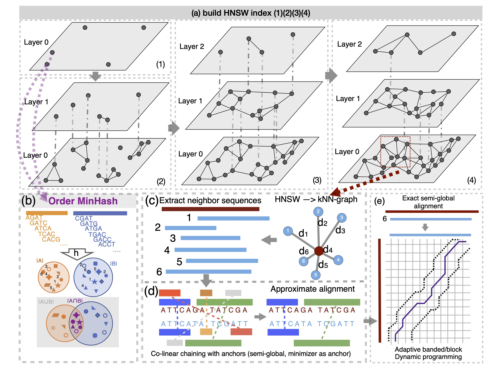

# Nonredun
metagenomic coverage estimation for long and accurate reads. Essentially this software is to find number of non-redundant reads as a signal for metagenomic coverage and diversity.

## Background
Metagenomic long reads sequencing is now more and more popular. Estimating the coverage of a metagenomic sample provides useful information about the diversity of the sample. Lander-Waterman expectation, or the generalized Stevens’ theorem can be used to do such an estimation. For shotgun metagenomic reads (short reads), it has implemented in a previous paper. However, for long and accurate reads, the idea behind (e.g., ungapped alignment) fails due to much longer sequneces and lower identities (Rodriguez-R et.al., 2014). And more importantly, sampling 10% of the metagenome to estimate coverage is not ideal solution. All versus all comparisons should be performed, despite being more computationally expensive.

## New algorithm for calculating the number of non-redundant reads
The key step is to obtain the number of non-redundant reads via all versus all comparison of each sequence in the metagenome, which is O(N^2), impractical for real-world metagenomic samples. To solve the problem, we adopt cutting-edge sketching algorithms and graph based nearest neighbor search for finding neighbor sequences of each sequence in a metagenome. There are three steps involved:
1. (Order) MinHash & HNSW for extracting the most similar sequences in an approximate manner for distantly related sequences in metagenome to each sequence. Order MinHash is kmer-based sketching method, approximating edit distance quite well. Via HNSW, the running time respect to number of sequences in metagenome is O(N*log(N)), see GSearch paper for details. However, this method is not optimal for sequences with different length.
2. To have even accurate estimation of alignment-based identity for sequneces with different length to find the most similar sequneces, we use co-linear chaining of anchors (can ber minimizers, MUMs or MEMs) with overlaps and gap costs, which approximate edit distance well above 90% identity (semi-global mode).
3. Exact semi-global alignment via adaptive banded dynamic programming implementation (not unit score scheme as in Edlib) (Liu et.al., 2023) only for the sequence with the highest chaining/alignment score.



## Usage
1. build HNSW database
```bash
adas-build -h

 ************** initializing logger *****************

MinHash sketching and Hierarchical Navigable Small World Graphs (HNSW) building for Long Sequences

Usage: adas-build [OPTIONS] --input <FASTA_FILE>

Options:
  -i, --input <FASTA_FILE>                    Input FASTA file
  -k, --kmer-size <KMER_SIZE>                 Size of k-mers, must be ≤14 [default: 8]
  -s, --sketch-size <SKETCH_SIZE>             Size of the sketch [default: 512]
  -t, --threads <THREADS>                     Number of threads for sketching [default: 1]
      --hnsw-capacity <HNSW_CAPACITY>         HNSW capacity parameter [default: 50000000]
      --hnsw-ef <HNSW_EF>                     HNSW ef parameter [default: 1600]
      --max_nb_connection <HNSW_MAX_NB_CONN>  HNSW max_nb_conn parameter [default: 256]
  -h, --help                                  Print help
  -V, --version                               Print version
```
2. Extract K Nearest neighbors (KNN)


3. Compute number of non-redundant reads


## Lander-Waterman expectation
We will then follow the same equation for estimation of coverage after obtaining the number of non-redundant reads in above steps.

$$\kappa = \frac{\gamma(\alpha, \beta*log(LR+1))}{\Gamma(\alpha)}=\frac{\int ^{\beta *log(LR+1)}_0 e^{-t}t^{\alpha-1}dt}{\int ^{\infty}_0 e^{-t}t^{\alpha-1}dt}$$

We ran some optimization for given Kappa and LR paris (total number of base pairs for a metgenome, subsampling to obtain multiple pairs) to obtian alpha and beta then create the curve for this given sample. The metagenomic diversity is then defined by:

$$\frac{\alpha-1}{\beta}$$


## Testing minimap2-rs reads overlap
This is just to test whether minimap2-rs (Rust wrapper around the C implementation) crate works for real-world data via implementing some parallelization. I will use it in nonredun crate for estimation of metagenomic coverage and diversity. 

The seed-chain-extend heuristic in various software packages such as minimap2 is theoretically guaranteed (Shaw and  Yu, 2023). The derivation is based on syncmer but not minimzer although in practice minimzer and (open)syncmer make no big difference in terms of accuracy for highly similar sequences (see Heng Li's blog here: https://lh3.github.io/2022/10/21/random-open-syncmers) and a recent paper using parameterized syncmer (Figure 6b) (Dutta et.al., 2022). It is clear that syncmer can improve mapping accuracy but only marginally at the expense of additional computation for various identity levels. For bacterial genomes we can expect ID to be as low as 50%. We can use other faster methods such as kmer-based MinHash to speed up the comparisons for distantly related sequences. 


## Benchmark
We use vsearch/usearch --allpairs_global to compare the results from minimap2 overlap alignment (semi-global). Both query alignment ratio and identity can be benchmarked. 


## References
```bash
@article{rodriguez2014nonpareil,
  title={Nonpareil: a redundancy-based approach to assess the level of coverage in metagenomic datasets},
  author={Rodriguez-r, Luis M and Konstantinidis, Konstantinos T},
  journal={Bioinformatics},
  volume={30},
  number={5},
  pages={629--635},
  year={2014},
  publisher={Oxford University Press}
}
@article{liu2023block,
  title={Block Aligner: an adaptive SIMD-accelerated aligner for sequences and position-specific scoring matrices},
  author={Liu, Daniel and Steinegger, Martin},
  journal={Bioinformatics},
  volume={39},
  number={8},
  pages={btad487},
  year={2023},
  publisher={Oxford University Press}
}
@article{li2018minimap2,
  title={Minimap2: pairwise alignment for nucleotide sequences},
  author={Li, Heng},
  journal={Bioinformatics},
  volume={34},
  number={18},
  pages={3094--3100},
  year={2018},
  publisher={Oxford University Press}
}
@article{dutta2022parameterized,
  title={Parameterized syncmer schemes improve long-read mapping},
  author={Dutta, Abhinav and Pellow, David and Shamir, Ron},
  journal={PLOS Computational Biology},
  volume={18},
  number={10},
  pages={e1010638},
  year={2022},
  publisher={Public Library of Science San Francisco, CA USA}
}
@article{shaw2023proving,
  title={Proving sequence aligners can guarantee accuracy in almost O (m log n) time through an average-case analysis of the seed-chain-extend heuristic},
  author={Shaw, Jim and Yu, Yun William},
  journal={Genome Research},
  volume={33},
  number={7},
  pages={1175--1187},
  year={2023},
  publisher={Cold Spring Harbor Lab}
}
```
